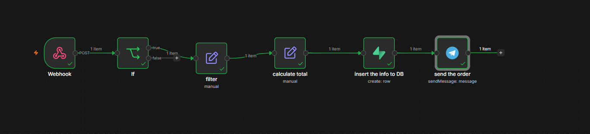
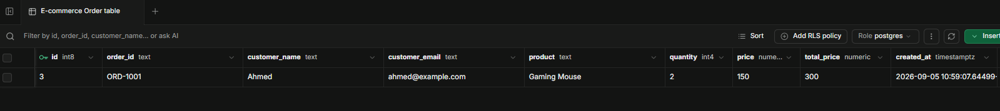
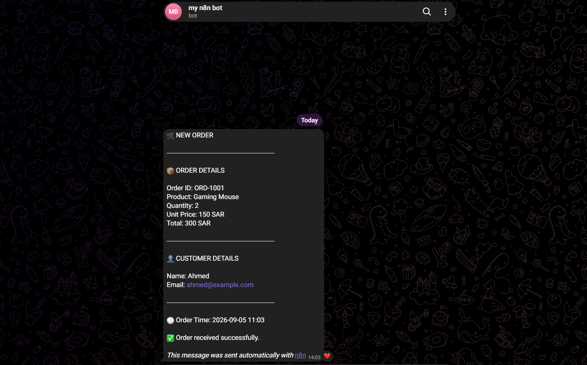

# E-commerce Order Automation

This is a simple e-commerce order automation project I built using n8n.

The idea is to automate what happens after a customer places an order.

## How it works

The workflow receives the order through a webhook, processes the order information, calculates the total price, saves the order in Supabase, and sends a notification to Telegram.

```text
Webhook
   ↓
Edit Fields
   ↓
Calculate Total
   ↓
Supabase
   ↓
Telegram
```

## What it does

* Receives order data through a webhook
* Gets the customer and order information
* Calculates the total price
* Saves the order in Supabase
* Sends a Telegram notification when a new order is received
* Adds the order creation time automatically

## Tools used

* n8n
* Supabase
* PostgreSQL
* Telegram Bot API
* Webhooks
* JSON

## Screenshots

### Workflow



### Database



### Telegram Notification



## Example

An example order sent to the webhook:

```json
{
  "order_id": "ORD-1001",
  "customer_name": "Ahmed",
  "customer_email": "ahmed@example.com",
  "product": "Gaming Mouse",
  "quantity": 2,
  "price": 150
}
```

The workflow calculates the total automatically:

```text
2 × 150 = 300 SAR
```

## Why I built this

I built this project to practice workflow automation and working with webhooks, APIs, databases, and external services using n8n.

This is a portfolio project and does not use real customer data.

## Project structure

```text
ecommerce-order-automation/
│
├── README.md
├── ecommerce-order-automation.json
│
└── screenshots/
    ├── workflow.png
    ├── database.png
    └── telegram.png
```
